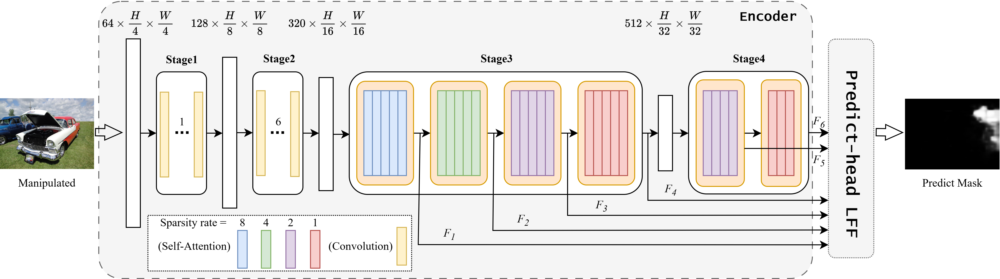

# Can We Get Rid of Handcrafted Feature Extractors? SparseViT: Nonsemantics-Centered, Parameter-Efficient Image Manipulation Localization through Spare-Coding Transformer

Official repository for the AAAI2025 paper  *Can We Get Rid of Handcrafted Feature Extractors? SparseViT: Nonsemantics-Centered, Parameter-Efficient Image Manipulation Localization through Spare-Coding Transformer* [[paper]](https://arxiv.org/abs/2412.14598) [[website]](https://github.com/scu-zjz/SparseViT).

<p float="left">
  
</p>

In summary, SparseViT leverages the distinction between semantic and non-semantic features, enabling the model to adaptively extract non-semantic features that are more critical for image manipulation localization. This provides a novel approach to precisely identifying manipulated regions.

## Test setup (Code + Models)

<details>
  <summary>1) Set up the coding environment</summary>
  <br></br>

   - First, clone the repository:

  ```bash
git clone https://github.com/scu-zjz/SparseViT.git
  ```

  - Our environment

  ```
Ubuntu LTS 20.04.1

CUDA 11.5 + cudnn 8.4.0

Python 3.10

PyTorch 2.4
  ```

  - You should install the packages in [requirements.txt](https://github.com/scu-zjz/SparseViT/blob/main/requirements.txt) 

  ```bash
pip install -r requirements.txt
  ```

</details>

<details>
  <summary>2)Download our pretrained checkpoints</summary>
  <br></br>
  Download our pretrained checkpoints from [Google_Drive](https://drive.google.com/drive/folders/1v-8I1WCbR0hpaV434yPgsFiimu6wWLCW?usp=drive_link) [Google Drive](https://github.com/scu-zjz/SparseViT/blob/main/requirements.txt)  and place them in checkpoint directory.
</details>

## Scripts

This should be super easy! Simply run

```
python main_test.py
```

Here, we have simply provided a basic test of SparseViT. Of course, you can train and test SparseViT within our proposed [IMDL-Bench](https://github.com/scu-zjz/IMDLBenCo) framework, as they are fully compatible.

## Citation

If you find our code useful, please consider citing us and give us a star! 

```
@misc{su2024can,
  title={Can We Get Rid of Handcrafted Feature Extractors? SparseViT: Nonsemantics-Centered, Parameter-Efficient Image Manipulation Localization Through Spare-Coding Transformer},
  author={Su, Lei and Ma, Xiaochen and Zhu, Xuekang and Niu, Chaoqun and Lei, Zeyu and Zhou, Ji-Zhe},
  year={2024},
  eprint={2412.14598},
  archivePrefix={arXiv},
  primaryClass={cs.CV}
}
```
